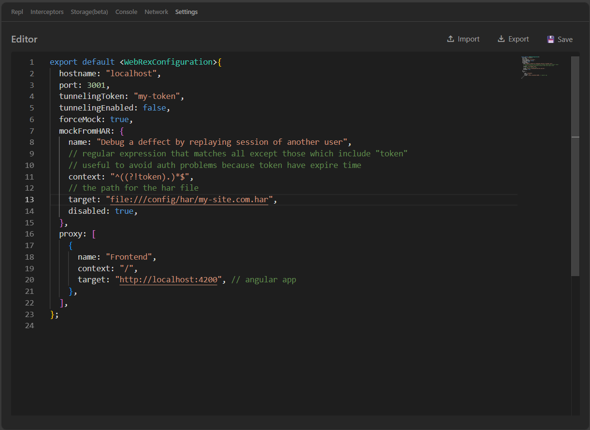

# WebRex

## Introduction

WebRex is a proxy, on steroids.

Its configuration tries to resemble webpack-dev-server (for simplicity and UX familiarity reasons).

It provides Web interface which you must access, to configure the proxy settings and all other features that WebRex has.

When you open WebRex it will open a terminal instance and will display 2 urls to be followed: one is the url where the proxy is running and the other is the url of the WebRex UI.

If you have an ngrok token configured in settings, you will also see the url of the ngrok tunnel and respective QRCode which an be scanned.

In short, this app is like if webpack-dev-server and Mockoon had a child (or a proxy and a mock server had a child) and chrome devtools was its uncle.

## How it works

### Install

- Download WebRex or [compile from source](#how-to-compile).
- Execute WebRex

::: info
   The first run takes longer to start because it's installing some assets in your home folder, under a directory created for it.
   A new terminal instance will popup it will display something like the following:
:::

```log
Starting...
Preparing DB...
Installing new version 2.0.0-rc.19...

Server started at http://localhost:3001
WebRex UI running at http://localhost:3001/webrex-ui
```

- Open WebRex UI on your favorite browser

### Configure
[Open WebRex on browser](http://localhost:3001/webrex-ui/settings), go to `settings` tab and adapt the configuration to your needs.



### Import or backup configurations

You can backup your configuration to a `*.json` file and restore later using the `settings`  page.

This allows you not only to save your snippets, interceptors and settings but also to share them with colleagues if needed.

**Setps to import**
1. Open settings page of WebUI
2. Press the `Import` button and locate the `*.json` file where you saved it

### Debugging
When running proxy, all request are logged with timestamp, duration in miliseconds, http status, request method and url used

ie:
```log
[2025-11-26T15:06:39.954Z]     3ms 200 POST   https://whatever.com/api/v1/my-service/aliens
```

## Why you need WebRex?
### Use Case 1
You have a web aplication and want to check it's behaviour in case the backend send a different response. Then:
- start the web app
- start WebRex
- open a browser tab and type the address where WebRex is running "{hostname}:{port}/webrex-ui" *(default is localhost:3001/webrex-ui)*
- configure WebRex configuration, in settings tab, with at least 2 proxy routes, where one points to the web app and the other points to the backend
- open another browser tab and type root address (same as above but without /webrex-ui pathname) of WebRex "{hostname}:{port}" *(default is localhost:3001)*
- it's important that you open the WebRex address instead of the web app address so that you call "WebRex-proxy -> web-app" and web-app calls "WebRex-proxy -> backend". Otherwise the proxy won't be in the middle and won't work as you expect


## Development

### Software Requirements
- [Deno Runtime ^2.3.1](https://docs.deno.com/runtime/getting_started/installation/)
- [Node >=20.19.6](https://nodejs.org/en/download) or [Bun ^1.3.5](https://bun.com/docs/installation)
- [Task ^3.46.3](https://taskfile.dev/docs/installation)

### Skills Requirements
- [Angular >=21](https://angular.dev/#learn-more)
- [Deno 2](https://docs.deno.com/runtime/) (most of the knowledge from NodeJS translates to Deno. Deno is just a better version of Node.)

### How to compile

To compile run the following command in the root folder of the project:
```sh
task compile
```

### How to run from source

To contribute to the project with development, run the backend and the frontend of WebRex in parallel:
```sh
task start:frontend
```
```sh
task start:backend
```
